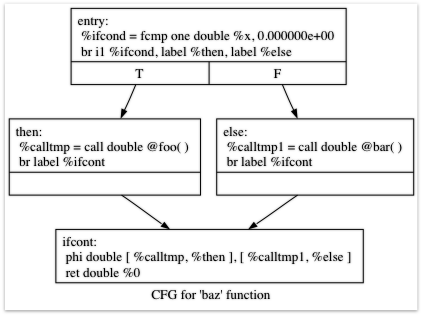

==================================================
Kaleidoscope: 言語の拡張: 制御フロー
==================================================

.. contents::
   :local:

第5章 はじめに
================

「 `LLVMを使った言語実装 <index.html>`_」チュートリアルの第5章へようこそ。第1-4部では、シンプルなKaleidoscope言語の実装を説明し、LLVM IRの生成サポート、それに続く最適化とJITコンパイラーを含みました。残念ながら、提示されたように、Kaleidoscopeはほとんど使えません: 呼び出しと戻り以外に制御フローがありません。これはコード内で条件分岐を持つことができないことを意味し、その力を著しく制限します。「コンパイラを構築しよう」のこのエピソードでは、Kaleidoscopeを拡張してif/then/else式とシンプルな'for'ループを持つようにします。

If/Then/Else
============

Kaleidoscopeを拡張してif/then/elseをサポートするのは非常に簡単です。基本的に、この「新しい」概念のサポートをlexer、parser、AST、およびLLVMコードエミッターに追加する必要があります。この例は素晴らしく、新しいアイデアが発見されるにつれて漸進的に拡張し、時間とともに言語を「成長」させることがいかに簡単かを示しているからです。

この拡張を「どのように」追加するかに取りかかる前に、「何を」望んでいるかを話しましょう。基本的なアイデアは、このようなものを書けるようにしたいということです: 

::

    def fib(x)
      if x < 3 then
        1
      else
        fib(x-1)+fib(x-2);

Kaleidoscopeでは、すべての構成要素が式です: 文はありません。そのため、if/then/else式は他の式と同じように値を返す必要があります。主に関数型を使用しているため、条件を評価し、条件がどのように解決されたかに基づいて'then'または'else'の値を返します。これはCの"?:"式と非常に似ています。

if/then/else式のセマンティクスは、条件をブール等価値に評価することです: 0.0は偽とみなされ、それ以外はすべて真とみなされます。条件が真の場合、最初の部分式が評価されて返され、条件が偽の場合、二番目の部分式が評価されて返されます。Kaleidoscopeは副作用を許可するため、この動作を確定することが重要です。

何を「望んでいる」かが分かったので、これを構成要素に分解してみましょう。

If/Then/Else用のLexer拡張
---------------------------------

lexerの拡張は簡単です。まず、関連するトークン用の新しいenum値を追加します: 

.. code-block:: c++

      // control
      tok_if = -6,
      tok_then = -7,
      tok_else = -8,

これができたら、lexerで新しいキーワードを認識します。これはかなり簡単なことです: 

.. code-block:: c++

        ...
        if (IdentifierStr == "def")
          return tok_def;
        if (IdentifierStr == "extern")
          return tok_extern;
        if (IdentifierStr == "if")
          return tok_if;
        if (IdentifierStr == "then")
          return tok_then;
        if (IdentifierStr == "else")
          return tok_else;
        return tok_identifier;

If/Then/Else用のAST拡張
-------------------------------

新しい式を表現するために、そのための新しいASTノードを追加します: 

.. code-block:: c++

    /// IfExprAST - Expression class for if/then/else.
    class IfExprAST : public ExprAST {
      std::unique_ptr<ExprAST> Cond, Then, Else;

    public:
      IfExprAST(std::unique_ptr<ExprAST> Cond, std::unique_ptr<ExprAST> Then,
                std::unique_ptr<ExprAST> Else)
        : Cond(std::move(Cond)), Then(std::move(Then)), Else(std::move(Else)) {}

      Value *codegen() override;
    };

ASTノードは、さまざまな部分式へのポインタを持つだけです。

If/Then/Else用のParser拡張
----------------------------------

lexerから関連するトークンが届き、構築するASTノードができたので、解析ロジックは比較的単純です。まず新しい解析関数を定義します: 

.. code-block:: c++

    /// ifexpr ::= 'if' expression 'then' expression 'else' expression
    static std::unique_ptr<ExprAST> ParseIfExpr() {
      getNextToken();  // eat the if.

      // 条件
      auto Cond = ParseExpression();
      if (!Cond)
        return nullptr;

      if (CurTok != tok_then)
        return LogError("expected then");
      getNextToken();  // eat the then

      auto Then = ParseExpression();
      if (!Then)
        return nullptr;

      if (CurTok != tok_else)
        return LogError("expected else");

      getNextToken();

      auto Else = ParseExpression();
      if (!Else)
        return nullptr;

      return std::make_unique<IfExprAST>(std::move(Cond), std::move(Then),
                                          std::move(Else));
    }

次に、これを基本式として接続します: 

.. code-block:: c++

    static std::unique_ptr<ExprAST> ParsePrimary() {
      switch (CurTok) {
      default:
        return LogError("unknown token when expecting an expression");
      case tok_identifier:
        return ParseIdentifierExpr();
      case tok_number:
        return ParseNumberExpr();
      case '(':
        return ParseParenExpr();
      case tok_if:
        return ParseIfExpr();
      }
    }

If/Then/ElseのためのLLVM IR
------------------------

解析とASTの構築ができたので、最後の部分はLLVMコード生成サポートの追加です。これはif/then/elseの例で最も興味深い部分です。なぜなら、ここから新しい概念を導入し始めるからです。上記のコードはすべて前の章で詳しく説明されています。

生成したいコードを説明するために、シンプルな例を見てみましょう。次を考えてみてください: 

::

    extern foo();
    extern bar();
    def baz(x) if x then foo() else bar();

最適化を無効にすると、Kaleidoscopeから (間もなく) 得られるコードは次のようになります: 

.. code-block:: llvm

    declare double @foo()

    declare double @bar()

    define double @baz(double %x) {
    entry:
      %ifcond = fcmp one double %x, 0.000000e+00
      br i1 %ifcond, label %then, label %else

    then:       ; preds = %entry
      %calltmp = call double @foo()
      br label %ifcont

    else:       ; preds = %entry
      %calltmp1 = call double @bar()
      br label %ifcont

    ifcont:     ; preds = %else, %then
      %iftmp = phi double [ %calltmp, %then ], [ %calltmp1, %else ]
      ret double %iftmp
    }

制御フローグラフを視覚化するために、LLVM '`opt <https://llvm.org/cmds/opt.html>`_' ツールの便利な機能を使用できます。このLLVM IRを「t.ll」に置き、「 ``llvm-as < t.ll | opt -passes=view-cfg``」を実行すると、 `ウィンドウがポップアップ <../../ProgrammersManual.html#viewing-graphs-while-debugging-code>`_ してこのグラフが表示されます: 

   CFGの例

これを取得する別の方法は、実際の呼び出しをコードに挿入して再コンパイルするか、デバッガーでこれらを呼び出すことで、「 ``F->viewCFG()``」または「 ``F->viewCFGOnly()``」を呼び出すことです (Fは「 ``Function*``」です) 。LLVMには、さまざまなグラフを視覚化するための多くの優れた機能があります。

生成されたコードに戻ると、これは非常にシンプルです: エントリブロックが条件式 (ここでは「x」) を評価し、「``fcmp one``」命令を使用して結果を0.0と比較します ('one'は「順序付きかつ非等価」の意味) 。この式の結果に基づいて、コードはtrue/falseケースの式を含む「then」または「else」ブロックのいずれかに分岐します。

then/elseブロックの実行が完了すると、どちらも'ifcont'ブロックに分岐して戻り、if/then/else後に起こるコードを実行します。この場合、残すべきことは関数の呼び出し元に戻ることだけです。そこで問題となるのは: コードはどの式を返すべきかをどのように知るのでしょうか？

この問題の答えには、重要なSSA操作が含まれます: `Phi操作 <http://en.wikipedia.org/wiki/Static_single_assignment_form>`_ です。SSAに馴染みがない場合、 `Wikipedia記事 <http://en.wikipedia.org/wiki/Static_single_assignment_form>`_ が良い入門となり、お好みの検索エンジンでさまざまな他の入門記事も利用できます。簡単に言うと、Phi操作の「実行」には、制御がどのブロックから来たかを「記憶」することが必要です。Phi操作は入力制御ブロックに対応する値を取ります。この場合、制御が「then」ブロックから来る場合、「calltmp」の値を取得します。制御が「else」ブロックから来る場合、「calltmp1」の値を取得します。

この時点で、あなたはおそらく「いやいや！これは私のシンプルでエレガントなフロントエンドがLLVMを使うためにSSAフォームを生成し始めなければならないということだ！」と考え始めているでしょう。幸いなことに、これは違います。そして、本当に驚くほど良い理由がない限り、フロントエンドでSSA構築アルゴリズムを実装*しない*ことを強くお勧めします。実際には、一般的な命令型プログラミング言語用に書かれたコードで浮遊し、Phiノードが必要になる可能性のある値には2つの種類があります: 

#. ユーザー変数を含むコード: ``x = 1; x = x + 1;``
#. この場合のPhiノードのように、ASTの構造に暗黙的な値

このチュートリアルの `第7章 <LangImpl07.html>`_  (「可変変数」) では、#1について詳しく説明します。今のところ、このケースを処理するのにSSA構築が必要ないということを信じてください。#2については、#1で説明する技法を使用するか、便利であればPhiノードを直接挿入する選択肢があります。この場合、Phiノードの生成は本当に簡単なので、直接行うことを選択します。

よし、動機と概要は十分です。コードを生成しましょう！

If/Then/Elseのコード生成
--------------------------------

これのコードを生成するために、``IfExprAST`` 用の ``codegen`` メソッドを実装します: 

.. code-block:: c++

    Value *IfExprAST::codegen() {
      Value *CondV = Cond->codegen();
      if (!CondV)
        return nullptr;

      // 条件を0.0と非等価比較してboolに変換
      CondV = Builder->CreateFCmpONE(
          CondV, ConstantFP::get(*TheContext, APFloat(0.0)), "ifcond");

このコードは分かりやすく、以前に見たものと似ています。条件の式を発行し、その値をゼロと比較して、1ビット (bool) 値として真理値を取得します。

.. code-block:: c++

      Function *TheFunction = Builder->GetInsertBlock()->getParent();

      // Create blocks for the then and else cases.  Insert the 'then' block at the
      // end of the function.
      BasicBlock *ThenBB =
          BasicBlock::Create(*TheContext, "then", TheFunction);
      BasicBlock *ElseBB = BasicBlock::Create(*TheContext, "else");
      BasicBlock *MergeBB = BasicBlock::Create(*TheContext, "ifcont");

      Builder->CreateCondBr(CondV, ThenBB, ElseBB);

このコードは、if/then/else文に関連するベーシックブロックを作成し、上記の例のブロックに直接対応します。最初の行は、構築中の現在のFunctionオブジェクトを取得します。これは、ビルダーに現在のBasicBlockを求め、そのブロックに「親」 (現在埋め込まれている関数) を求めることで取得します。

それが得られると、3つのブロックを作成します。「then」ブロックのコンストラクタに「TheFunction」が渡されることに注意してください。これにより、コンストラクタが指定された関数の最後に新しいブロックを自動的に挿入します。他の2つのブロックは作成されますが、まだ関数に挿入されていません。

ブロックが作成されたら、それらの間で選択する条件分岐を発行できます。新しいブロックを作成してもIRBuilderに暗黙的に影響しないため、まだ条件が入ったブロックに挿入していることに注意してください。また、「else」ブロックがまだ関数に挿入されていないにもかかわらず、「then」ブロックと「else」ブロックへの分岐を作成していることにも注意してください。これはすべて問題ありません: LLVMが前方参照をサポートする標準的な方法です。

.. code-block:: c++

      // Emit then value.
      Builder->SetInsertPoint(ThenBB);

      Value *ThenV = Then->codegen();
      if (!ThenV)
        return nullptr;

      Builder->CreateBr(MergeBB);
      // Codegen of 'Then' can change the current block, update ThenBB for the PHI.
      ThenBB = Builder->GetInsertBlock();

条件分岐が挿入された後、ビルダーを「then」ブロックへの挿入を開始するように移動します。厳密に言えば、この呼び出しは挿入ポイントを指定されたブロックの末尾に移動します。ただし、「then」ブロックは空であるため、ブロックの先頭から挿入を開始します。:)

挿入ポイントが設定されると、ASTから「then」式を再帰的にコード生成します。「then」ブロックを完成させるために、マージブロックへの無条件分岐を作成します。LLVM IRの興味深い (そして非常に重要な) 側面の一つは、すべてのベーシックブロックがreturnまたはbranchのような :ref:`制御フロー命令 <terminators>`で :ref:`「終端」される必要がある <functionstructure>`ことです。これは、*フォールスルーを含む*すべての制御フローがLLVM IRで明示的に記述される必要があることを意味します。このルールに違反すると、検証器がエラーを発行します。

ここの最後の行は非常に繊細ですが、とても重要です。基本的な問題は、マージブロックでPhiノードを作成するとき、Phiがどのように動作するかを示すブロック/値ペアを設定する必要があることです。重要なことは、PhiノードはCFG内のブロックの各先行ブロックに対してエントリを持つことを期待していることです。それではなぜ、上の5行でThenBBに設定したばかりなのに、現在のブロックを取得しているのでしょうか？問題は、「Then」式が、例えばネストした「if/then/else」式を含んでいる場合、実際にBuilderが発行しているブロックを変更する可能性があることです。 ``codegen()`` を再帰的に呼び出すことで現在のブロックの概念が任意に変更される可能性があるため、Phiノードを設定するコードのために最新の値を取得する必要があります。

.. code-block:: c++

      // Emit else block.
      TheFunction->insert(TheFunction->end(), ElseBB);
      Builder->SetInsertPoint(ElseBB);

      Value *ElseV = Else->codegen();
      if (!ElseV)
        return nullptr;

      Builder->CreateBr(MergeBB);
      // codegen of 'Else' can change the current block, update ElseBB for the PHI.
      ElseBB = Builder->GetInsertBlock();

「else」ブロックのコード生成は、基本的に「then」ブロックのコード生成と同じです。唯一の重要な違いは最初の行で、これが「else」ブロックを関数に追加します。以前に「else」ブロックは作成されましたが、関数に追加されていなかったことを思い出してください。「then」と「else」ブロックが出力されたので、マージコードで仕上げることができます: 

.. code-block:: c++

      // Emit merge block.
      TheFunction->insert(TheFunction->end(), MergeBB);
      Builder->SetInsertPoint(MergeBB);
      PHINode *PN =
        Builder->CreatePHI(Type::getDoubleTy(*TheContext), 2, "iftmp");

      PN->addIncoming(ThenV, ThenBB);
      PN->addIncoming(ElseV, ElseBB);
      return PN;
    }

ここの最初の2行は見慣れたものです: 最初の行は「merge」ブロックをFunctionオブジェクトに追加します (以前は上のelseブロックのように浮いていました) 。2番目は挿入ポイントを変更して、新しく作成されるコードが「merge」ブロックに入るようにします。それが完了したら、PHIノードを作成し、PHI用のブロック/値ペアを設定する必要があります。

最後に、CodeGen関数は、if/then/else式によって計算された値としてphiノードを返します。上記の例では、この戻り値はトップレベル関数のコードに供給され、return命令を作成します。

総合的に、これでKaleidoscopeで条件付きコードを実行する能力を手に入れました。この拡張により、Kaleidoscopeはさまざまな数値関数を計算できる、かなり完全な言語になりました。次に、非関数型言語から馴染みのある別の有用な式を追加します...

'for' Loop Expression
=====================

基本的な制御フロー構成を言語に追加する方法を知ったので、より強力なものを追加するツールが手に入りました。より積極的なもの、つまり'for'式を追加しましょう: 

::

     extern putchard(char);
     def printstar(n)
       for i = 1, i < n, 1.0 in
         putchard(42);  # ascii 42 = '*'

     # print 100 '*' characters
     printstar(100);

この式は新しい変数 (この場合は「i」) を定義し、開始値から反復し、条件 (この場合は「i < n」) が真である間、オプションのステップ値 (この場合は「1.0」) でインクリメントします。ステップ値が省略された場合は、デフォルトで1.0になります。ループが真である間、本体の式を実行します。返す適切なものが他にないため、ループは常に0.0を返すものとして定義します。将来可変変数を持つようになれば、より有用になるでしょう。

以前と同様に、これをサポートするためにKaleidoscopeに必要な変更について話しましょう。

'for'ループ用のLexer拡張
-----------------------------------

lexer拡張は、if/then/elseと同じ種類のものです: 

.. code-block:: c++

      ... in enum Token ...
      // control
      tok_if = -6, tok_then = -7, tok_else = -8,
      tok_for = -9, tok_in = -10

      ... in gettok ...
      if (IdentifierStr == "def")
        return tok_def;
      if (IdentifierStr == "extern")
        return tok_extern;
      if (IdentifierStr == "if")
        return tok_if;
      if (IdentifierStr == "then")
        return tok_then;
      if (IdentifierStr == "else")
        return tok_else;
      if (IdentifierStr == "for")
        return tok_for;
      if (IdentifierStr == "in")
        return tok_in;
      return tok_identifier;

'for'ループ用のAST拡張
---------------------------------

ASTノードも同じくらいシンプルです。基本的に、変数名とノード内の構成要素の式を捉えることに要約されます。

.. code-block:: c++

    /// ForExprAST - Expression class for for/in.
    class ForExprAST : public ExprAST {
      std::string VarName;
      std::unique_ptr<ExprAST> Start, End, Step, Body;

    public:
      ForExprAST(const std::string &VarName, std::unique_ptr<ExprAST> Start,
                 std::unique_ptr<ExprAST> End, std::unique_ptr<ExprAST> Step,
                 std::unique_ptr<ExprAST> Body)
        : VarName(VarName), Start(std::move(Start)), End(std::move(End)),
          Step(std::move(Step)), Body(std::move(Body)) {}

      Value *codegen() override;
    };

'for'ループ用のParser拡張
------------------------------------

parserコードもかなり標準的です。ここで唯一興味深いのは、オプションのステップ値の処理です。parserコードは、2番目のカンマが存在するかどうかをチェックすることでこれを処理します。ない場合は、ASTノードでステップ値をnullに設定します: 

.. code-block:: c++

    /// forexpr ::= 'for' identifier '=' expr ',' expr (',' expr)? 'in' expression
    static std::unique_ptr<ExprAST> ParseForExpr() {
      getNextToken();  // eat the for.

      if (CurTok != tok_identifier)
        return LogError("expected identifier after for");

      std::string IdName = IdentifierStr;
      getNextToken();  // eat identifier.

      if (CurTok != '=')
        return LogError("expected '=' after for");
      getNextToken();  // eat '='.

      auto Start = ParseExpression();
      if (!Start)
        return nullptr;
      if (CurTok != ',')
        return LogError("expected ',' after for start value");
      getNextToken();

      auto End = ParseExpression();
      if (!End)
        return nullptr;

      // The step value is optional.
      std::unique_ptr<ExprAST> Step;
      if (CurTok == ',') {
        getNextToken();
        Step = ParseExpression();
        if (!Step)
          return nullptr;
      }

      if (CurTok != tok_in)
        return LogError("expected 'in' after for");
      getNextToken();  // eat 'in'.

      auto Body = ParseExpression();
      if (!Body)
        return nullptr;

      return std::make_unique<ForExprAST>(IdName, std::move(Start),
                                           std::move(End), std::move(Step),
                                           std::move(Body));
    }

そして再び、これを基本式として接続します: 

.. code-block:: c++

    static std::unique_ptr<ExprAST> ParsePrimary() {
      switch (CurTok) {
      default:
        return LogError("unknown token when expecting an expression");
      case tok_identifier:
        return ParseIdentifierExpr();
      case tok_number:
        return ParseNumberExpr();
      case '(':
        return ParseParenExpr();
      case tok_if:
        return ParseIfExpr();
      case tok_for:
        return ParseForExpr();
      }
    }

'for'ループ用のLLVM IR
--------------------------

さて、良い部分に入ります: これに対して生成したいLLVM IRです。上記のシンプルな例では、このLLVM IRが得られます (このダンプは明瞭さのために最適化を無効にして生成されていることに注意してください) : 

.. code-block:: llvm

    declare double @putchard(double)

    define double @printstar(double %n) {
    entry:
      ; initial value = 1.0 (inlined into phi)
      br label %loop

    loop:       ; preds = %loop, %entry
      %i = phi double [ 1.000000e+00, %entry ], [ %nextvar, %loop ]
      ; body
      %calltmp = call double @putchard(double 4.200000e+01)
      ; increment
      %nextvar = fadd double %i, 1.000000e+00

      ; termination test
      %cmptmp = fcmp ult double %i, %n
      %booltmp = uitofp i1 %cmptmp to double
      %loopcond = fcmp one double %booltmp, 0.000000e+00
      br i1 %loopcond, label %loop, label %afterloop

    afterloop:      ; preds = %loop
      ; loop always returns 0.0
      ret double 0.000000e+00
    }

このループには、以前に見たのと同じ構成要素がすべて含まれています: phiノード、複数の式、およびいくつかのベーシックブロック。これらがどのように組み合わされるかを見てみましょう。

'for'ループのコード生成
----------------------------------

codegenの最初の部分は非常にシンプルです: ループ値の開始式を出力するだけです: 

.. code-block:: c++

    Value *ForExprAST::codegen() {
      // Emit the start code first, without 'variable' in scope.
      Value *StartVal = Start->codegen();
      if (!StartVal)
        return nullptr;

これで準備ができたので、次のステップはループ本体の開始用のLLVMベーシックブロックを設定することです。上記のケースでは、ループ本体全体が1つのブロックですが、本体コード自体が複数のブロックで構成される可能性があること (例えば、if/then/elseやfor/in式を含む場合) を覚えておいてください。

.. code-block:: c++

      // Make the new basic block for the loop header, inserting after current
      // block.
      Function *TheFunction = Builder->GetInsertBlock()->getParent();
      BasicBlock *PreheaderBB = Builder->GetInsertBlock();
      BasicBlock *LoopBB =
          BasicBlock::Create(*TheContext, "loop", TheFunction);

      // Insert an explicit fall through from the current block to the LoopBB.
      Builder->CreateBr(LoopBB);

このコードは、if/then/elseで見たものと似ています。Phiノードを作成するために必要になるので、ループにフォールスルーするブロックを記憶しています。それができたら、ループを開始する実際のブロックを作成し、2つのブロック間のフォールスルー用の無条件分岐を作成します。

.. code-block:: c++

      // Start insertion in LoopBB.
      Builder->SetInsertPoint(LoopBB);

      // Start the PHI node with an entry for Start.
      PHINode *Variable = Builder->CreatePHI(Type::getDoubleTy(*TheContext),
                                             2, VarName);
      Variable->addIncoming(StartVal, PreheaderBB);

ループの「プリヘッダー」が設定されたので、ループ本体のコードを発行することに切り替えます。まず、挿入ポイントを移動し、ループ誘導変数用のPHIノードを作成します。開始値の入力値をすでに知っているので、それをPhiノードに追加します。Phiは最終的にバックエッジ用の2番目の値を取得することに注意してください。ただし、まだそれを設定することはできません (存在しないためです！) 。

.. code-block:: c++

      // Within the loop, the variable is defined equal to the PHI node.  If it
      // shadows an existing variable, we have to restore it, so save it now.
      Value *OldVal = NamedValues[VarName];
      NamedValues[VarName] = Variable;

      // Emit the body of the loop.  This, like any other expr, can change the
      // current BB.  Note that we ignore the value computed by the body, but don't
      // allow an error.
      if (!Body->codegen())
        return nullptr;

ここからコードがより興味深くなり始めます。私たちの'for'ループはシンボルテーブルに新しい変数を導入します。これは、シンボルテーブルが関数引数またはループ変数のいずれかを含むことができることを意味します。これを処理するため、ループの本体をコード生成する前に、ループ変数をその名前の現在の値として追加します。外側のスコープに同じ名前の変数が存在する可能性があることに注意してください。これをエラーにするのは簡単でしょう (VarNameのエントリがすでに存在する場合はエラーを発行してnullを返す) が、変数のシャドウイングを許可することを選択します。これを正しく処理するために、 ``OldVal`` で潜在的にシャドウイングしているValueを記憶します (シャドウイングされた変数がない場合はnullになります) 。

ループ変数がシンボルテーブルに設定されると、コードは本体を再帰的にコード生成します。これにより、本体がループ変数を使用できるようになります: その変数への参照は、自然にシンボルテーブルでそれを見つけます。

.. code-block:: c++

      // Emit the step value.
      Value *StepVal = nullptr;
      if (Step) {
        StepVal = Step->codegen();
        if (!StepVal)
          return nullptr;
      } else {
        // If not specified, use 1.0.
        StepVal = ConstantFP::get(*TheContext, APFloat(1.0));
      }

      Value *NextVar = Builder->CreateFAdd(Variable, StepVal, "nextvar");

本体が発行されたので、ステップ値を追加することで反復変数の次の値を計算します。存在しない場合は1.0を使用します。'``NextVar``'は、ループの次の反復におけるループ変数の値になります。

.. code-block:: c++

      // Compute the end condition.
      Value *EndCond = End->codegen();
      if (!EndCond)
        return nullptr;

      // Convert condition to a bool by comparing non-equal to 0.0.
      EndCond = Builder->CreateFCmpONE(
          EndCond, ConstantFP::get(*TheContext, APFloat(0.0)), "loopcond");

最後に、ループの終了値を評価して、ループが終了すべきかどうかを判断します。これは、if/then/else文の条件評価を反映します。

.. code-block:: c++

      // Create the "after loop" block and insert it.
      BasicBlock *LoopEndBB = Builder->GetInsertBlock();
      BasicBlock *AfterBB =
          BasicBlock::Create(*TheContext, "afterloop", TheFunction);

      // Insert the conditional branch into the end of LoopEndBB.
      Builder->CreateCondBr(EndCond, LoopBB, AfterBB);

      // Any new code will be inserted in AfterBB.
      Builder->SetInsertPoint(AfterBB);

ループ本体のコードが完了したので、その制御フローを仕上げるだけです。このコードは終了ブロック (phiノード用) を記憶し、次にループ終了用のブロック (「afterloop」) を作成します。終了条件の値に基づいて、ループを再び実行するかループを終了するかを選択する条件分岐を作成します。将来のコードは「afterloop」ブロックで発行されるため、挿入位置をそこに設定します。

.. code-block:: c++

      // Add a new entry to the PHI node for the backedge.
      Variable->addIncoming(NextVar, LoopEndBB);

      // Restore the unshadowed variable.
      if (OldVal)
        NamedValues[VarName] = OldVal;
      else
        NamedValues.erase(VarName);

      // for expr always returns 0.0.
      return Constant::getNullValue(Type::getDoubleTy(*TheContext));
    }

最終的なコードはさまざまなクリーンアップを処理します: 「NextVar」の値を取得したので、ループPHIノードに入力値を追加できます。その後、forループ後にスコープ内にならないように、シンボルテーブルからループ変数を削除します。最後に、forループのコード生成は常に0.0を返すため、それが ``ForExprAST::codegen()``から返すものです。

これで、チュートリアルの「Kaleidoscopeに制御フローを追加する」章が完了します。この章では、2つの制御フロー構成を追加し、フロントエンド実装者が知っておくべきLLVM IRの重要な側面をいくつか紹介しました。私たちの物語の次の章では、少し過激になって、かわいそうで無邪気な言語に `ユーザー定義演算子 <LangImpl06.html>`_ を追加します。

全コードリスト
=================

これは実行中の例の完全なコードリストで、if/then/else式とfor式で強化されています。この例をビルドするには、次を使用してください: 

.. code-block:: bash

    # Compile
    clang++ -g toy.cpp `llvm-config --cxxflags --ldflags --system-libs --libs core orcjit native` -O3 -o toy
    # Run
    ./toy

コードはこちらです: 

.. literalinclude:: ../../../examples/Kaleidoscope/Chapter5/toy.cpp
   :language: c++

`次: 言語の拡張: ユーザー定義演算子 <LangImpl06.html>`_

